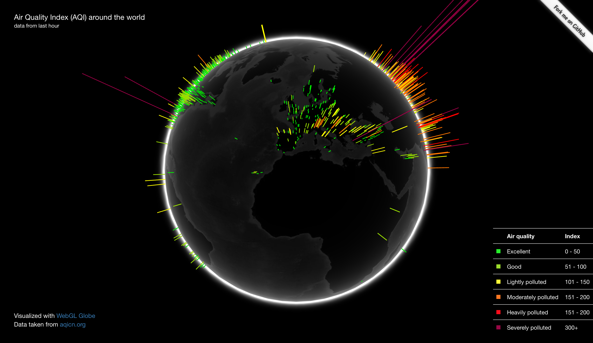

# Pollution globe



Pollution globe visualizes air quality around the world using
[WebGL Globe](https://experiments.withgoogle.com/chrome/globe) and data from
[aqicn](http://aqicn.org/).

## Quick setup

Create virtual environment in cloned/downloaded repository and install required packages.

```
python3 venv -m venv
source venv/bin/activate
pip install -r requirements.txt
```

Run app.

```
python runner.py
```


Open `localhost:5000` in your browser.
